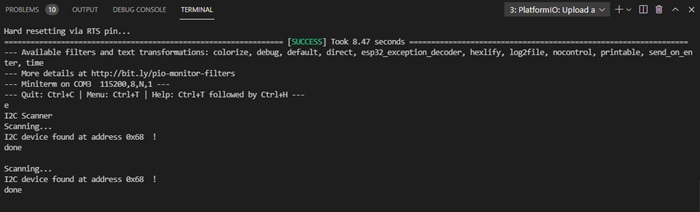

Pol Naharro
## PRACTICA 5 : Buses de comunicación I (introducción y I2c)
##### Ejercicio Practico 1 ESCÁNER I2C:
##### Código:

```
#include <Arduino.h>
#include <Wire.h>
/*
#include "MAX30105.h"
#include <Adafruit_I2CDevice.h> 
#include <Adafruit_GFX.h>
#include <Adafruit_SSD1306.h>
 */
 
void setup()
{
  Wire.begin();
 
  Serial.begin(115200);
  while (!Serial);             // Leonardo: wait for serial monitor
  Serial.println("\nI2C Scanner");
}
 
void loop()
{
  byte error, address;
  int nDevices;
 
  Serial.println("Scanning...");
 
  nDevices = 0;
  for(address = 1; address < 127; address++ )
  {
    // The i2c_scanner 
    // the Write.endTransmisstion to see if
    // a device did acknowledge to the address.
    Wire.beginTransmission(address);
    error = Wire.endTransmission();
 
    if (error == 0)
    {
      Serial.print("I2C device found at address 0x");
      if (address<16)
        Serial.print("0");
      Serial.print(address,HEX);
      Serial.println("  !");
 
      nDevices++;
    }
    else if (error==4)
    {
      Serial.print("Unknown error at address 0x");
     if (address<16)
        Serial.print("0");
      Serial.println(address,HEX);
    }    
  }
  if (nDevices == 0)
    Serial.println("No I2C devices found\n");
  else
    Serial.println("done\n");
 
  delay(5000);           // wait 5 seconds for next scan
}
```
##### Explicación:

Esta práctica nos enseña si hay algun dispositivo I2C conectado a nosotros.

Comenzando por el setup inicializamos el wire y luego el Serial para poder ver la pantalla del monitor después. A continuación realizamos Serial.println("\nI2C Scanner"); para sacar esto por pantalla.

En el loop  también hacemos un println para indicar que estamos escaneando. Después hacemos un for, que realiza las siguientes instruciones Wire.beginTransmission(address); y error = Wire.endTransmission(); para comenzar la transmisión y en caso de error que se registre también, con dos posibles salidas. La primera es si no hay ningún error y entonces se muestra el dispositivo encontrado por pantalla junto a su información como la dirección y suma en un contador de nDevices, generado antes del for, una posición. El segundo nos indica que hay un error y la dirección en la que se encuentra este.

Si después del bucle for no hay dispositivos el contador nDevices sigue a 0 y hacemos Serial.println("No I2C devices found\n"); en un if para indicar por pantalla que no hay dispositivos. Si no el else hace un Serial.println("done\n"); indicando que sí que ha acabado.

##### Funcionamiento de la práctica:

Comprobación:

